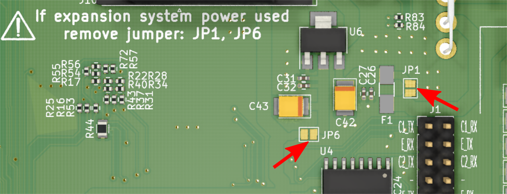
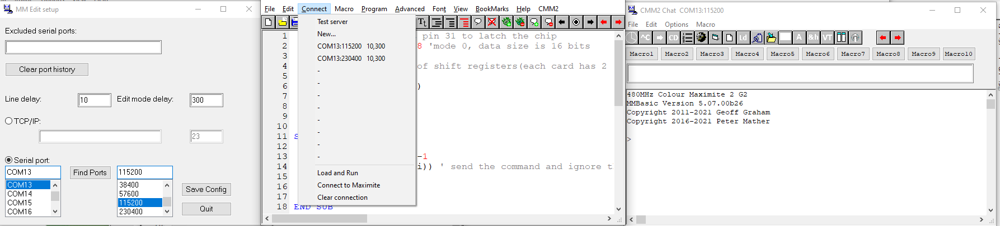

# Table of contents
1. [ Colour Maximite 2 Deluxe Edition GEN2 ](#desc)
2. [ Main features ](#feat)
3. [ What are the differences? ](#diff)
4. [ Flashing CPU ](#flashcpu)
	- [ UART flashing method ](#uartflash)
	- [ USB flashing method ](#usbflash)
5. [ Expansion system ](#exps)
	- daisy chaining with other expansion systems
	- [ Powering Maximite from expansion Power Card ](#powc)
	- [ Expansion cards ](#expc)
6. [ WiFi ESP01 ](#wifi)
	- [ ESP01 setup ](#wifisetup)
	- [ ESP01 flashing ](#wififlash)
7. [ UBS mouse host chip ](#mouse)
	- [ example code ](#mousecode)
	- flashing
8. Nunchuk
9. [ Atari joystick ](#joy)
10. [ IR sensor ](#ir)
11. [ RTC ](#rtc)
12. MM edit


	
# WARNING!


| :warning: Expansion card have to have edges chamfered using unchamfered card will result in slot damage. |
| --- |

<a name="desc"></a>
# 1. Colour Maximite 2 Deluxe Edition GEN2

The product is based on the Color Maximite 2 GEN2 - Geoff's project. It is 100% compatible with it and has been extended with additional functions.
Color Maximite 2 Deluxe Edition GEN 2 is produced in Poland.
The Color Maximite 2 Deluxe Edition GEN2 is an enhanced version of previous generation.

Schematic can be found here: [schematic REV E v02](/Schematic/CCM2_Deluxe_GEN2_REVE_ver02.pdf)

Maximite, expansion system and cards can be purchased here: [PS Labs](https://sklep.pslabs.pl/Maximite-c91)

<a name="feat"></a>
# 2. Main features
- built-in ARM Cortex-M7 32-bit RISC processor clocked at 480MHz
- 32MB external RAM
- 3 sockets to connect 3 Wii Nunchuk controllers (as opposed to 1 socket in the original design)
- socket for connecting a standard joystick, e.g. Atari
- reset button
- flash button
- 5 edge connectors for expansion cards 
- 40 and 26 pin IDC for connecting expansion system
- USB socket for keyboard connection
- USB socket for mouse connection
- USB to UART for: communication, CPU flashing, mouse chip flashing and ESP01 flashing
- IR sensor
- RTC clock chip
- audio jack
- VGA socket
- power switch
- SD card slot
- LEDs indicating power and activity
- built-in battery for RTC

<a name="diff"></a>
# 3. What are the differences?
Table below shows main differences in Maximite 2 family

| Parameter | Colour Maximite 2 Deluxe GEN2| Colour Maximite 2 Deluxe | Colour Maximite 2 GEN2 | Colour Maximite 2 |
| --- | --- |  --- |  --- |  --- | 
| Processor speed | 480MHz | 480MHz | 480 MHz | 400-480MHz |
| Ram | 32MB | 16MB | 32MB | 16MB |
| Color depth | 24 bit | 16 bit | 24 bit | 16 bit |
| Build in expansion system | YES | no | no | no |
| Compatible with external expansion system | YES | no | no | no |
| Build in USB mouse chip | YES | YES | no | no |
| RTC chip | YES | no | no | YES |
| Number of Nunchuk ports | 3 | 3 | 2 | 1 |
| Atari joystick port | YES | YES | no | no |
| WiFi ESP01 support | YES | YES | YES | no |
| Reset button | YES | YES | no | no |
| Flash button | YES | YES | no | no |
| Easy flashable ESP01 | YES | YES | no | no |
| Easy flashable Mouse Chip | YES | no | no | no |


<a name="flashcpu"></a>
# 4. Flashing CPU
CPU can be flashed using one of following methods:

<a name="uartflash"></a>
## UART flashing method
This is the slowest method, if possible consider using USB method

Needed tools and software:
- USB A-B cable
- PC with Windows
- STM32CubeProgrammer software installed can be downloaded here: [STM32CubeProgrammer software for all STM32](https://www.st.com/en/development-tools/stm32cubeprog.html)

Procedure:
1. Set J1 jumpers to as shown below:


2. Connect USB A-B cable to maximite and PC
3. Open STM32CubeProgrammer program


4. Select UART
5. Select COM port
6. Press and hold FLASH button and press RESET button while still holding FLASH
7. Press connect, successful connection will be reported in Log


8. Go to Erasing & Programming tab


9. Browse and select firmware
10. Press Start Programming button, flashing will start:


11. Successful flashing will be reported by po-up window and Log:


12. Press disconnect button
13. Reboot the unit by using power switch or RESET switch

<a name="usbflash"></a>
## USB flashing method
This method is much faster than UART method, requires USB A-A cable

Needed tools and software:
- USB A-A cable
- PC with Windows
- STM32CubeProgrammer software installed can be downloaded here: [STM32CubeProgrammer software for all STM32](https://www.st.com/en/development-tools/stm32cubeprog.html)

Procedure:
1. Connect USB A-A cable to maximite keyboard port and PC
2. Open STM32CubeProgrammer program
3. Press and hold FLASH button and press RESET button while still holding FLASH, You should hear Windows found device sound


4. Press refresh icon and select USB1 (or other) from drop down menu
5. Remaining steps are identical as those described in **UART flashing method** starting from step 7


<a name="exps"></a>
# 5. Expansion system


Maximite Deluxe 2 GEN2 is equiped with 5 edge connectors used with expansion cards.
IDC40 (J9) and IDC26 (J13) are used to daisy chain expansion modules: [Expansion Module](https://github.com/pslabs-ps/CMM2-Expansion-System)

<a name="powc"></a>
## Powering Maximite from expansion Power Card
If You need to power Maximite system from Power card please remove solder jumpers JP1 and JP6 marked below to disconnect internal power sources. 12V DC 2,5/5,5mm connector is used to supply Power Cards.



<a name="expc"></a>
## Expansion cards
Following expansion cards are available or are in development:

| ID | Name | Desc. | Status |
| --- | --- | --- | --- |
| 01 | [Mouse/joystick card](https://github.com/pslabs-ps/CMM2-ExpansionCard-MouseJoy) | adds: USB mouse (HT chip) including wireless, Atari joystick, Nunchuk port | done |
| 02 | Relay card | Relay card controlled by shift registers, can be daisy chained, only 3 pins needed to operate multiple cards | in progress |
| 03 | Power card | delivers high amperage 5V and 3.3V to be used with power hungry cards | done |
| 04 | [Prototyping card](https://github.com/pslabs-ps/CMM2-ExpansionCard-ProtoSimple)| simple prototyping card | done |
| 05 | [WiFi card](https://github.com/pslabs-ps/CMM2-ExpansionCard-WiFi) | adds wifi functionality, includes USB to RS chip allowing easy flashing and communication with pc | done |
| 06 | [Shift register card](https://github.com/pslabs-ps/CMM2-ExpansionCard-ShiftRegisterLed) | helps to learn how shift registers work, 16 led operated from 3 pins, can be daisy chained | done |
| 07 | rs232 card | adds 2 standard RS232 ports | in progress |


<a name="wifi"></a>
# 6. WiFi ESP01
This card adds wifi functionality, includes USB to RS chip allowing easy flashing and communication with pc

<a name="wifisetup"></a>
## ESP01 setup


use jumper J1 to configure COM port that CPU is using to communicate with ESP module as shown abowe

<a name="wififlash"></a>
## ESP01 flashing


1. Use jumper J1 to connect Maximiate USB to UART chip with ESP module ash shown abowe


2. Connect USB A-B cable to PC and Maximite
3. Power on Maximite
4. Find out which COM port is detected by PC
5. Select COM port in Your flashing tool
6. Start flash


7. Hold PROG. button and press RESET button while still holding PROG. button
8. Wait until flash completes


<a name="mouse"></a>
# 7. UBS mouse host chip
Device is equiped with HT mouse host chip that allows to connect many devices available on the market. Mouse is connected to bottom USB port.

<a name="mousecode"></a>
## example code
Below You can find sample code for mouse test using HT chip

```basic
mode 3
gui cursor on
controller mouse open 2,leftclick,rightclick
settick 20, myint
do:loop
'
sub myint
  gui cursor mouse(x,2),mouse(y,2)
end sub
'
sub leftclick
  static integer n
  local integer x=mouse(x,2),y=mouse(y,2)
  gui cursor off
  gui cursor on 1,x,y,rgb(red)
  n=n+1
  print @(100,100)"left",n
  end sub
'
sub rightclick
  static integer n=0
  local integer x=mouse(x,2),y=mouse(y,2)
  gui cursor off
  gui cursor on 0,x,y
  n=n+1
  print @(200,100)"Right",n
end sub
```

## flashing


# 8. Nunchuk


<a name="joy"></a>
# 9. Atari joystick
In table below You can find pinout for Atari Joystick DB9 socket:

| DB9 pin | Function | Maximite IDC40 pin |
| --- | --- | --- |
| 1 | UP | 35 |
| 2 | DOWN | 36 |
| 3 | LEFT | 38 |
| 4 | RIGHT | 40 |
| 5 | nc | nc |
| 6 | BUTTON A | 32 |
| 7 | +5V | +5V |
| 8 | GND | GND |
| 9 | BUTTON B | 33 |

Code example can be found below:

```basic
SETPIN 35, DIN, PULLUP
SETPIN 36, DIN, PULLUP
SETPIN 38, DIN, PULLUP
SETPIN 40, DIN, PULLUP
SETPIN 32, DIN, PULLUP

DO
  IF PIN(35) = 0 THEN PRINT"UP"
  IF PIN(36) = 0 THEN PRINT"DOWN"
  IF PIN(38) = 0 THEN PRINT"LEFT"
  IF PIN(40) = 0 THEN PRINT"RIGT"
  IF PIN(32) = 0 THEN PRINT"FIRE"
  PAUSE 100
LOOP
```

<a name="ir"></a>
# 10. IR sensor
Device is equiped with IR sensor, only standard RC remotes will work with libraries included in MMBasic

Example code can be found below:
```basic
IR dev, KeyCode, IR_Int
Do

LOOP

SUB IR_Int
  PRINT "Received device = " DevCode "  key = " KeyCode
END SUB
```

<a name="rtc"></a>
# 11. RTC
Device is equiped with with RTC chip. Out of the box Maximite is using CPU RTC, to change to external RTC use following code:

```
OPTION DS3231 ON
```

after enabling external RTC remeber to set the date:

```
DATE$ = "DD-MM-YY"
```

To turn off external RTC use code below

```
OPTION DS3231 OFF
```


# 12. MM edit
Buid in code editor is not the only way code can be edited and tested. You can find MM edit more effective way to write and test programs on Maximite.

You can download it here: [MM Edit2](https://www.c-com.com.au/MMedit2.htm)

To use MM Edit with Maximite:


1. Set J1 jumpers as shown above
2. Connect maximite to PC with USB A-B cable and power the device
3. Find out COM port detected by PC

4. Open MM Edit program
5. From drop down menu select:
**Connect >> New...**
6. Select serial port and speed (default: 115200)
7. Press Save configure
8. From drop down menu select:
**Connect** and select newly created configure
9  From drop down menu select:
**Connect >> Connect to Maximite**

After creating new code You can send it and automaticaly run in maximite by selecting from deop down menu **Connect >> Load and Run**